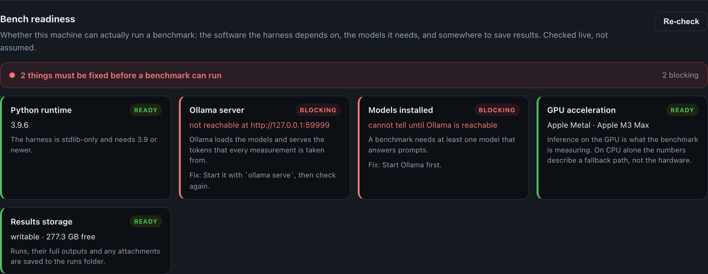
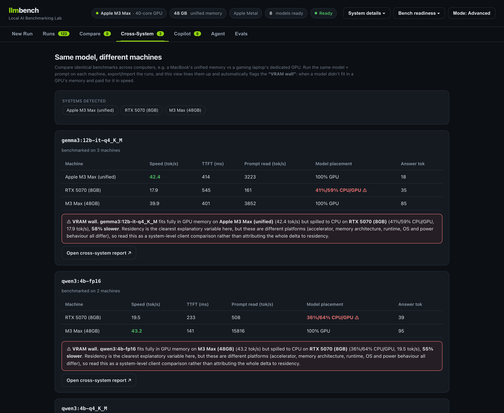

# llm-bench-lab

A benchmarking harness for running AI models on your own computer, built to
answer a question that a single tokens-per-second number cannot: **what will
this model actually feel like on this machine, and where does it fall apart?**

It runs on NVIDIA RTX and Apple Silicon from the same codebase, measures the
things a user actually notices, and writes every result down in plain English
next to the caveats that qualify it.

Python 3.9+ standard library only. No pip install. MIT licensed.

```bash
git clone https://github.com/ishpatel/llm-bench-lab && cd llm-bench-lab
python bench.py doctor      # is this machine ready?
python bench.py serve       # then open http://127.0.0.1:8765
```

---

## Why local inference needs its own benchmark

Running a model on your own hardware fails differently than calling an API, and
the usual headline number hides all of it.

**Generating an answer has two distinct phases.** *Prefill* reads your prompt and
is compute-bound; *decode* writes the answer one token at a time and, for a
single user, is bound by memory bandwidth rather than compute. A machine can be
good at one and bad at the other, so this harness reports them separately.

**A model either fits in memory or it does not, and the difference is a cliff.**
When a model exceeds the GPU's memory the runtime keeps part of it in system RAM
and moves data across the PCIe bus for every token. Throughput does not degrade
gracefully; it collapses. Measured here at **56–57% lower** decode throughput on
the two configurations that crossed an 8 GB boundary.

**Weights are not the only thing that has to fit.** The KV cache grows with how
much context you allocate. A 5.2 GB model that fits comfortably at 4K context
spilled at 16K on the same 8 GB card without a single weight changing.

**Latency is two clocks, not one.** Time to the first token the model computes is
not the same as time to the first word you can read, because reasoning models
think first. On one measured run those diverged 231 ms vs 2,122 ms. Both are
reported.

None of that is visible in "X tokens/sec." All of it changes which model you
should ship.

---

## What it looks like

Everything runs locally in your browser. Every metric carries a plain-English
reading, because a number nobody can interpret does not travel.

**A benchmark run, explained.** Each metric has a verdict, tagged with the
machine that produced it, alongside the model's answer and four dimensions for
you to score it on. Speed means nothing if the output is wrong.


**Your hardware, and separately, whether the bench can run.** *What is this
machine* and *can it produce a measurement* are different questions, so they get
different sections.


**It checks itself before you benchmark.** Every dependency is probed live and
marked **ready**, **optional** or **blocking**, with the command that fixes it.
Optional items say what you lose: no embedding model means no Copilot, but
benchmarks still run.



**History, labelled by machine.** One history can hold runs from several
machines, so each row carries a colour-coded chip and the list filters by
machine. Sorted by speed the machines interleave, which is exactly when an
unlabelled row misleads.


**The same model on two machines.** Runs are paired by model, the memory cliff is
flagged automatically, and the throughput cost is computed for you.



**Ask your own documents.** A local retrieval pipeline with numbered citations
and per-stage timing for embedding, retrieval and generation.


**Tools that a model cannot fire on its own.** The model proposes an action;
deterministic code decides whether it runs. Here an approval rail holds a
power-limit change.


**Behaviour turned into a score.** Groundedness, correct abstention and safety,
graded reproducibly rather than by a second model's opinion.


**A report you can hand to someone else.** Self-contained HTML, no external
requests, every number annotated.


---

## Results from the reference campaign

A full campaign was run on two machines: an RTX 5070 laptop (8 GB dedicated
VRAM) and an M3 Max (48 GB unified memory). The raw output is frozen in
[`sample-results/`](sample-results/), so every number below can be checked
against the data that produced it.

### The memory cliff

Two roughly 8.1 GB configurations crossed the 8 GB boundary on the RTX laptop and
spilled across CPU and GPU memory, while both stayed fully resident in the M3
Max's unified pool. All four figures are the `short_qa` cells of the
`cross-system` run on each machine, so the prompt and the experiment are held
constant:

| Model | RTX 5070 (8 GB) | M3 Max (48 GB) | Cost of spilling |
|---|---|---|---|
| gemma3:12b-it-q4_K_M | 17.9 tok/s, 41%/59% CPU/GPU | 40.4 tok/s, fully resident | 56% lower |
| qwen3:4b-fp16 | 19.1 tok/s, 36%/64% CPU/GPU | 44.0 tok/s, fully resident | 57% lower |

Models that fit are far closer: qwen3:4b-q4_K_M measured 97.5 vs 101.8 tok/s on
the same prompt, and on one reasoning case the RTX at Q8 edged the Mac.

The practical reading: when a workload fits, these two very different machines
deliver broadly similar interactive speed. Once the memory boundary is crossed,
the experience changes sharply. **Fit matters more than raw speed.**

### Context capacity moves the boundary

qwen3:8b-q4_K_M is only 5.2 GB. It stayed resident at 4K and 8K context and
spilled at 16K and 32K on the RTX, without a single weight changing. Allocating
context is spending memory, and the budget is the same one the weights come from.

### What quantization actually buys

On the Mac, where measurement noise is low enough to read a curve, the same 4B
model across three precisions: Q4 at 102.9 tok/s, Q8 at 72.7, FP16 at 44.1.
Roughly 2.3x from FP16 to Q4, consistent with decode being bandwidth-bound:
fewer bytes per weight means fewer bytes moved per token.

### Two caveats recorded with the data

**Reproducibility differs by machine.** M3 Max within-run spread is 0.0–2.9%. The
RTX laptop's median spread is 1.5–2.2%, but individual cells reach 19.6% and its
Q8 measurement disagrees between experiments (70.0 vs 79.3 tok/s). The clean
precision curve therefore comes from the Mac; the RTX supplies the memory
boundary, where the effects are large relative to that noise. Quoting an exact
RTX ratio would overstate what the data supports.

**These are different platforms, not an isolated GPU comparison.** Accelerator,
memory architecture, runtime, OS and power behaviour all differ. Read the results
as a system-level client comparison. Residency percentages in particular are not
comparable between unified and discrete memory.

The hypotheses and falsification criteria in [TESTPLAN.md](TESTPLAN.md) were
written before the data existed and preserved as written.

---

## How the numbers are made defensible

Benchmarks are easy to run and easy to get wrong. The methodology is fixed in
code rather than left to whoever runs it:

- **Warm-up runs are executed and discarded** before anything is recorded.
- **Each cell runs N measured repeats** and reports the **median with the
  min–max spread**, so a single lucky run cannot become the headline.
- **Cold start is measured separately**, by evicting the model and timing the
  next call, and kept out of the warm latency figures.
- **Generation options are held constant** across machines, so only the intended
  variable changes.
- **Latency is wall-clock**, measured client-side, not read from a server's own
  report of itself. This matters more than it sounds: see below.
- **One benchmark runs at a time.** The job queue has a single worker because two
  generations sharing a GPU would corrupt each other's timings.
- **Spread is surfaced, not hidden.** When repeats disagree by more than 10% the
  tooling says so and tells you to treat the ratio as indicative.

---

## Using it

### The web app

```bash
python bench.py serve            # http://127.0.0.1:8765
```

Pick a model, type a prompt, optionally attach documents or images, and run it.
The run is queued, you watch live progress, and when it finishes you get metrics
with plain-English verdicts plus the model's actual answer. Rate the answer on
four dimensions; those scores appear in the history so you can find the model
that is both fast *and* correct.

Every field explains itself, including the **Advanced** panel that exposes the
methodology knobs (repeats, warm-up, cold start, temperature, max tokens,
context length). The defaults are the rigorous ones.

Runs are stored under `runs/<id>/` and are portable — copy a run folder to
another machine to merge histories.

### The command line

```bash
python bench.py doctor                      # check the environment first
python bench.py run configs/quant-sweep.json --label "M3 Max (48GB)"
python bench.py summary results/*.json      # re-print metrics for saved results
python bench.py report results/*.json --out results/report.html
```

`run`, `summary` and `report` all print the same table: median speed, time to the
first visible word, prompt-reading throughput, token counts and whether the model
fit on the GPU, followed by a plain-English reading and any caveat.

```
Run                               Speed  First word  Reading  Cold start   In / Out  Placement
qwen3:4b-q4_K_M · short_qa         97.5         119    2,747       2,087    31 / 33   100% GPU
qwen3:4b-fp16 · short_qa           19.1         214      546       7,707    31 / 39  36%/64% CPU/GPU

What this means
  - Fastest (prompt held constant): qwen3:4b-q4_K_M at 97.5 tok/s, 5.4x gemma3:12b-it-q4_K_M.
  ! qwen3:4b-fp16 did not fit entirely on the GPU (36%/64% CPU/GPU) in all 3 of its runs.
  - qwen3:4b-q8_0 varied by 14% across repeats (69.9-79.4 tok/s), so treat its ratio as
    indicative rather than exact.
```

The headline comparison holds the prompt constant, because ranking across
different prompts would compare cells that differ in two variables at once.
Colour is dropped automatically when output is piped, and `NO_COLOR` is honoured.

### Benchmarking a real task, with documents and images

Attach `files` and `images` to a prompt to measure a model on actual work rather
than a synthetic sentence:

```jsonc
"prompts": [
  {
    "key": "spec_qa",
    "text": "Using only the reference material, how much VRAM does this GPU have?",
    "files": ["docs/rtx-spec.md"],       // text documents injected as context
    "images": ["docs/screenshot.png"]     // requires a vision model
  }
]
```

Any injected document inflates `prompt_tokens`, so prefill metrics and
time-to-first-token **measure the cost of context** directly. Cap injected size
with `max_chars_per_file`.

| Type | How it is extracted | Notes |
|---|---|---|
| `.txt .md .csv .json .py` … | read directly | plain-text family |
| `.pdf` | `pdftotext` if installed, else a built-in stdlib parser | handles text-based PDFs; scanned or CID-font PDFs are flagged rather than silently empty |
| `.docx .pptx .xlsx .odt` | stdlib `zipfile` + XML | no external tools needed |
| `.rtf .doc` | macOS `textutil` if present | legacy `.doc` needs conversion elsewhere |
| `.html .htm` | tag stripping | scripts and styles removed |

Each file's extraction method and any quality warnings appear in the report next
to the attachment, so a low-confidence extraction is never silent. Images are
base64-encoded and need a vision model; text-only models ignore them.

```bash
python bench.py run configs/task-with-doc.json   # grounded vs ungrounded demo
python bench.py run configs/task-with-pdf.json   # exercises the PDF extractor
```

### Comparing two machines

Run the same config on both machines, then merge:

```bash
# on each machine, same repo, same config
python bench.py run configs/cross-system.json --label "M3 Max (48GB)"
python bench.py run configs/cross-system.json --label "RTX 5070 (8GB)"

# copy both results files to one machine
python bench.py report results/cross-system_*.json --out results/cross.html
```

In the web app, use **Export** on one machine and **Import** on the other, then
open the **Cross-System** tab. Any model present on two or more machines is shown
side by side, with the memory cliff flagged automatically and the throughput cost
computed. `bench.py adopt` pulls CLI results into the web history if you prefer
to start on the command line and finish in the UI.

### Alternate engines: TensorRT-LLM, NIM, vLLM

By default runs go through Ollama, whose engine is llama.cpp. Any server speaking
the **OpenAI-compatible API** can be used instead, which lets you put two engines
head-to-head on the same GPU, model and prompt.

```bash
pip install tensorrt-llm
trtllm-serve <hf-model>        # OpenAI-compatible API on port 8000
```

Then tick **OpenAI-compatible backend** in the web app and enter the URL, or add
this to a config:

```jsonc
"backend": { "type": "openai", "base_url": "http://host:8000", "label": "TensorRT-LLM" }
```

Runs are labelled with the engine so results never get mixed up. Speed metrics
are measured identically; cold start is skipped because the external engine
manages its own loading, and Ollama residency does not apply. The endpoint can be
remote, so a Mac can drive benchmarks against an RTX machine over the network.

One caveat to state in any comparison: **engines do not share model formats.**
TensorRT-LLM builds from HuggingFace checkpoints, not the GGUF files Ollama uses,
so an engine head-to-head compares the same architecture and parameter count, not
an identical quantization.

> **TensorRT-LLM and TensorRT for RTX are different products.** TensorRT-LLM is
> the LLM serving stack: Linux-focused, ships `trtllm-serve`, does
> OpenAI-compatible serving and KV-cache management. That is what the backend
> above connects to. **TensorRT for RTX** is a lightweight *client* inference
> runtime for RTX PCs on Windows, embedded in an application through ONNX Runtime
> or Windows ML using portable ahead-of-time engines with on-device JIT. It ships
> no LLM server, so it is not a drop-in backend here.

---

## Beyond speed

A fast wrong answer is not a good product. Three layers above the model are
measurable too, and each is built explicitly rather than imported as a black box.

### Copilot: retrieval over your own documents

```
documents ─(extract)→ text ─(chunk)→ chunks ─(embed)→ vectors ─→ local JSON index
question ─→ vector ─(cosine similarity)→ top-k chunks ─→ grounded prompt ─→ answer + [n] citations
```

Drop in documents, pick an embedding model, and they are chunked and embedded
into a local index. Questions retrieve the most similar chunks by pure-Python
cosine similarity, and answers come back with inline `[n]` citations and the
retrieved source text shown beneath. When the answer is not in the sources the
model is told to say so rather than guess, which you can verify by asking
something the documents do not cover.

It is still a benchmark: every answer reports embedding, retrieval, first-token
and generation timings separately.

### Agent: tools the model cannot fire on its own

The operating principle is that **the model proposes and deterministic code
authorizes.** The LLM may request an action; plain Python decides whether it
runs.

Two tools: `get_gpu_status` (read-only, runs freely) and `set_power_limit`
(bounded 80–115 W, schema-validated, requires human approval, and simulated even
then, so no hardware is touched). Five rails sit around them: **input**
(injection and disallowed-intent detection), **tool allowlist** (least
privilege), **parameter** (types and bounds), **approval** (consequential actions
gated), and **output** (secret-leak check). The UI shows a live trace of which
rail fired and what was blocked.

### Evaluation: behaviour as evidence

Two suites, runnable in the UI or via `python bench.py eval rag|guardrails`:

- **Retrieval quality** — answerable, ambiguous and impossible question buckets,
  scored with retrieval versus the raw model on correctness, groundedness
  (citations that resolve), and, critically, **correct abstention** when the
  corpus does not contain the answer.
- **Guardrail enforcement** — adversarial inputs (injection, forbidden actions,
  out-of-range arguments, approval-gated actions) scored on *outcome*: the unsafe
  action must not happen, whichever rail stops it.

Scoring is deterministic keyword and abstention detection, not an LLM judge, so
results are reproducible.

### A worked example

`corpus/local_ai_life_lab/` is a synthetic personal-data corpus (28 files:
warranties, receipts, transactions, an itinerary, a resume, pantry inventory, PC
telemetry, an application policy, and a deliberately malicious document). No real
personal data. `evals/life_lab_tests.json` maps its ground truth onto 14 scored
cases.

```bash
python bench.py eval life_lab
```

On an M3 Max with `qwen3:4b-q4_K_M` and `embeddinggemma`:

| | Passed | Hallucinations | Grounded | Correct abstentions |
|---|---|---|---|---|
| **With retrieval** | **13/14** | **0** | 11 | 2/2 |
| Raw model | 5/14 | 4 | 0 | 0/2 |

The cases exercise reasoning across two documents (warranty length in a PDF,
purchase date in a receipt), resolving a conflict where an itinerary says 3:00 PM
and a later email updates check-in to 4:00 PM, detecting a duplicate subscription
charge, and abstaining on facts the corpus does not contain — including a
passport number where the corpus *does* hold a passport expiration date as bait.

---

## What running it actually taught

The findings that changed the tool are worth more than the ones that confirmed
it. These are recorded because they are the reason to trust the rest.

**A client-side delay nearly invalidated an entire campaign.** An RTX run
measured 2,071 ms ± 12.9 ms of unexplained latency on every request, constant
across 45 runs regardless of model size or speed. Ollama's own timings looked
healthy, so throughput was fine while every latency number was wrong. The cause
was the Windows `localhost` connection path; the literal `127.0.0.1` removed it
entirely (21.5 ms after). That is consistent with IPv6 `::1` being tried first,
though no packet capture was taken, so the mechanism stays unconfirmed. The
default is now `127.0.0.1` and the affected campaign was discarded and re-run
rather than published. **Trusting a server's report of its own speed would have
hidden this completely.**

**Failing loudly caught a real bug.** The built-in PDF parser flags "no
extractable text" instead of returning an empty string. That is how a filter
*chain* bug surfaced: ReportLab writes text through `/Filter [/ASCII85Decode
/FlateDecode]` and the decoder only tried raw Flate. A silent failure would have
quietly corrupted three eval cases.

**A security instruction cost accuracy.** Adding a warning about untrusted
retrieved content regressed 2 of 14 eval cases, because the extra instruction
competes for the model's attention. It is now applied only when the retrieval
rail actually flags something. The cost was measured rather than assumed.

**The remaining eval failure is a retrieval limit, not an arithmetic one.** On
"total July subscription spend" the model sums 5 of 7 qualifying rows ($105.96 vs
$136.94) because at k=5 with 900-character chunks the CSV splits and not every
row reaches the context. RAG quality is bounded by retrieval, and fixed-size
chunking is a poor fit for tabular data.

**The corpus ground truth had an off-by-one-cent error** ($136.93 stated, $136.94
actual), found only by running the eval and corrected with the errata recorded
inline.

**A keyword scorer can pass a lucky guess.** On the hotel case the raw model
answered "typically ranges from 2:00 PM to 4:00 PM" and matched the expected
"4:00" while knowing nothing. The retrieval-versus-raw *delta*, hallucination
count and grounded count are sharper signals than pass rate alone.

**Abstention detection has to know the corpus's own wording.** The model echoed
the policy phrase "does not establish the answer", which the detector did not
recognise, scoring a correct abstention as a failure.

### Known limits

- Tabular retrieval fails on the CSV case above; no fix attempted yet.
- Citation validity is checked structurally (the cited index exists), not
  semantically. A citation can resolve and still not support the sentence.
- RTX Q8 measurements are not reproducible enough to quote a precise ratio.
- There is no unit test suite. Verification has been end-to-end and manual.

---

## Reference

### Commands

| Command | What it does |
|---|---|
| `serve` | Launch the web UI (`--host`, `--port`) |
| `doctor` | Check dependencies and environment; exits 1 if anything blocks a run |
| `info` | Print the detected system, Ollama status and installed models |
| `run CONFIG` | Execute a benchmark config, print the metrics, write a results JSON |
| `summary RESULTS...` | Re-print the metrics table for saved results files |
| `report RESULTS...` | Build an HTML report; pass multiple files to compare machines |
| `export RUN_ID` | Export a web-UI run to a portable `.llmbench.json` bundle |
| `import BUNDLE` | Import a run bundle from another machine |
| `adopt RESULTS...` | Import CLI results into the web-UI history, one run per cell |
| `eval SUITE` | Run an evaluation suite (`rag`, `guardrails`, `life_lab`, or a path) |

`--base-url` is accepted before or after the subcommand.

### Metrics captured per run

| Metric | Meaning |
|---|---|
| `ttft_ms` | Time to the first token the model computes, including hidden reasoning |
| `ttfv_ms` | Time to the first **visible** token, which is what a user perceives. Identical to `ttft_ms` on non-thinking models; on a reasoning model these diverged 231 ms vs 2,122 ms |
| `gen_tps` | Decode speed, output tokens per second |
| `prompt_tps` | Prefill speed, prompt tokens per second |
| `load_ms` | Model load time (cold start) |
| `wall_total_ms` | Full request round-trip |
| `prompt_tokens` / `output_tokens` | Token counts in and out |
| `residency` | Where the model actually ran, e.g. `100% GPU` or `36%/64% CPU/GPU` |
| GPU sample (NVIDIA) | Peak and average utilisation, peak VRAM, power, temperature |

### Config format

```jsonc
{
  "name": "quant-sweep",          // used in output filenames
  "runs": 3,                       // measured repeats; median reported
  "warmup": 1,                     // discarded warm-up runs
  "measure_cold_start": true,      // evict, then time a genuine cold start
  "options": { "temperature": 0, "num_predict": 256 },   // held constant
  "models": ["qwen3:4b-q4_K_M", "qwen3:4b-q8_0"],
  "context_lengths": [null],       // null = model default, or [4096, 8192, 16384]
  "prompts": ["short_qa", "reasoning", "prefill_stress"] // keys into prompts.json
}
```

Prompts live in `configs/prompts.json` as `{ key: { text, note } }`. For thinking
models such as Qwen3, add `"think": false` to `options` to disable the reasoning
stream — worth doing in a speed comparison, since otherwise you are also
measuring how much a model chooses to think.

### Included configs

| Config | What it is for |
|---|---|
| `smoke.json` | One model, one prompt, one run: a few seconds, to prove the setup works |
| `cross-system.json` | The shared matrix run on both machines |
| `quant-sweep.json` | One 4B model at Q4, Q8 and FP16 |
| `quant-reverse.json` | The same sweep in reverse model order, as a thermal and ordering control |
| `context-scaling.json` | One model across 4K to 32K context capacity |
| `task-with-doc.json` | A grounded-versus-ungrounded task using a Markdown reference |
| `task-with-pdf.json` | The same, exercising the PDF extractor |
| `mac.json` | Apple-Silicon-only matrix |

### Project layout

```
bench.py                CLI entry point
llmbench/
  ollama.py             streaming Ollama client + per-generation timing
  backends.py           OpenAI-compatible engine client (TensorRT-LLM, NIM, vLLM)
  runner.py             matrix expansion, methodology, aggregation
  config.py             config and prompt loading and validation
  telemetry.py          platform detection, residency, nvidia-smi sampler
  readiness.py          dependency and environment checks
  console.py            terminal rendering for results and readiness
  report.py             self-contained HTML with inline SVG charts
  extract.py            document text extraction (pdf, docx, pptx, xlsx, …)
  attachments.py        inject reference documents, encode images
  rag.py                chunking, embedding, retrieval, grounded prompts
  agent.py              tool-calling loop
  guardrails.py         deterministic input/tool/parameter/approval/output rails
  evals.py              scoring for retrieval quality and guardrail enforcement
  store.py              per-run persistence under runs/<id>/
  jobs.py               single-worker job queue
  server.py             stdlib web server and JSON API
  web/index.html        the single-page UI
configs/                benchmark configs, prompt set, sample reference documents
corpus/                 synthetic document corpus for the worked example
evals/                  evaluation suites
sample-results/         frozen raw output from the reference campaign
results/  runs/  kb/    generated output (gitignored)
```

### Requirements

- Python 3.9+, standard library only
- [Ollama](https://ollama.com) running locally (`ollama serve`)
- Models pulled ahead of time; each config lists what it needs
- Optional on NVIDIA: `nvidia-smi` on PATH for live GPU telemetry

### When something is missing

Every case below is checked before any measurement starts, exits non-zero, and
writes no results file, so a broken environment cannot be mistaken for a finished
benchmark.

| Situation | What happens |
|---|---|
| Ollama not installed or not running | Names the URL it tried and how to start it |
| No models pulled | Names every missing model with the `ollama pull` command for each, and stops |
| Some models pulled | Warns about the missing ones, measures the rest, says which |
| Config or prompt file missing or malformed | Names the file and the cause, and lists the available configs |
| Prompt key not in the prompt set | Names the key and the file the keys live in |
| External backend unreachable | Names the endpoint and the URL it tried |
| A model loads but a run fails | The cell is marked failed; the summary reports how many repeats succeeded |

`python bench.py doctor` reports all of it at once and exits non-zero if anything
blocks a run, so it can gate a campaign:

```bash
python bench.py doctor && python bench.py run configs/cross-system.json
```

The web app degrades the same way: it still starts, shows why it cannot run, and
disables the run button rather than failing on submit.

---

## Going deeper

- **[ARCHITECTURE.md](ARCHITECTURE.md)** — how the pieces fit, the two contracts
  that make them compose, and the reasoning behind each module.
- **[TESTPLAN.md](TESTPLAN.md)** — the experiments, with hypotheses and
  falsification criteria written before the data existed.
- **[sample-results/](sample-results/)** — the frozen raw output, so the numbers
  above can be checked rather than taken on trust.

## License

[MIT](LICENSE).
